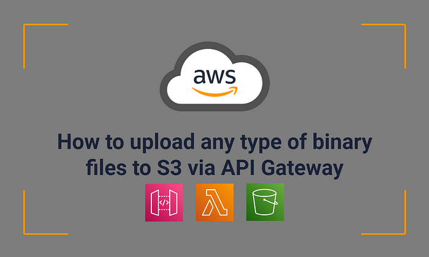
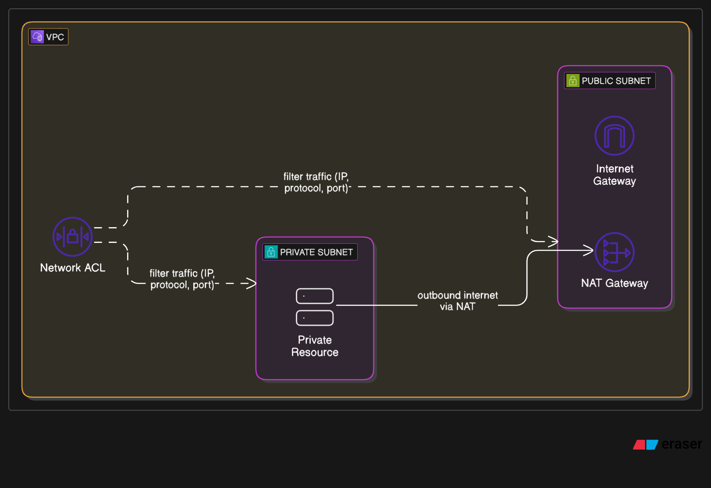
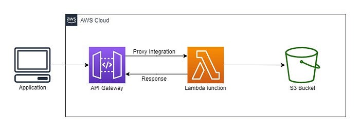
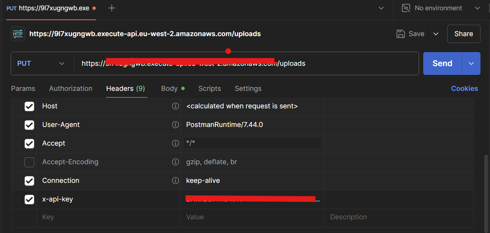
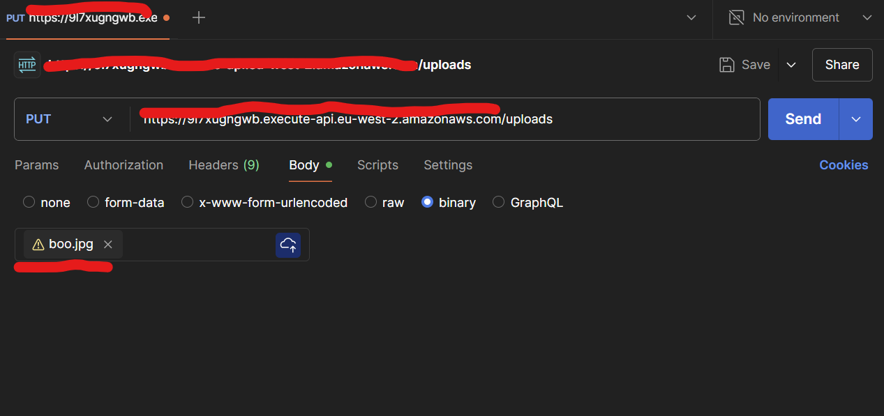
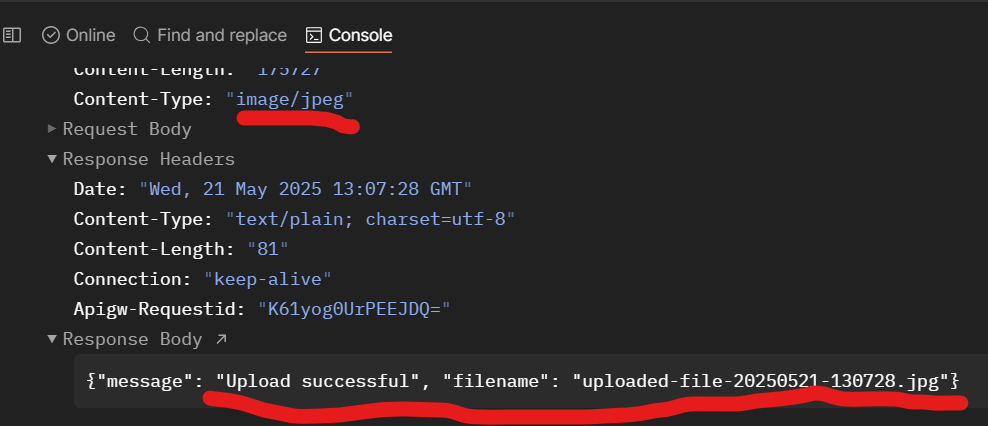

# Prerequisite
- Install terraform

  chmod +x install.sh

  sudo ./install.sh

- Validate installation
  
  terraform -version

- Deploy resources manually

  cd ./terraform

  terraform init

  terraform validate

  terraform plan
  
  terraform apply

- type in yes when prompted or use 
  
  terraform apply --auto-approve

# Deploy resources automatically

- Create a new branch make any change and submit a pr. 
- Merge the pr.
- Wait for the terraform action to complete.

# Deploy a VPC

# Deploy base infrastructure

# Upload a file after the deployment is completed using POSTMAN

